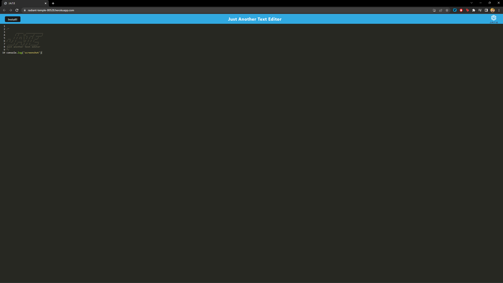

  # 19 Progressive Web Application

  ## Description
  This was built to make a progressive web app with saved caches and service workers.

  
  
  
  
  ## Table of Contents
  1. [Installation](#installation)
  2. [Usage](#usage)
  3. [Contributions](#contributions)
  4. [Tests](#tests)
  5. [License](#license)
  6. [Questions](#questions)
  
  
  ## Installation
  Copy SSH key in GitHub repo. Git clone into your coding software.
  
  
  ## Usage
  Once the repo is cloned, open in terminal and use npm run build, to make the dist file. Then npm run start:dev to run the server locally.
  OR 
  Navigate to https://radiant-temple-80528.herokuapp.com/

  
  
  
  ## Contributions
  Starter code from UCF Boot Camp and help from instructor.
  
  
  ## Tests
  None
  

  ## License
  Copyright (c) [colewaggoner](https://github.com/colewaggoner). All rights reserved. 
  Licensed under the [Unlicense license](https://choosealicense.com/licenses/unlicense/).
  
  
  ## Questions
  If you have any questions please contact me here:
  
Email: waggcj02@gmail.com
  
GitHub: [colewaggoner](https://github.com/colewaggoner)